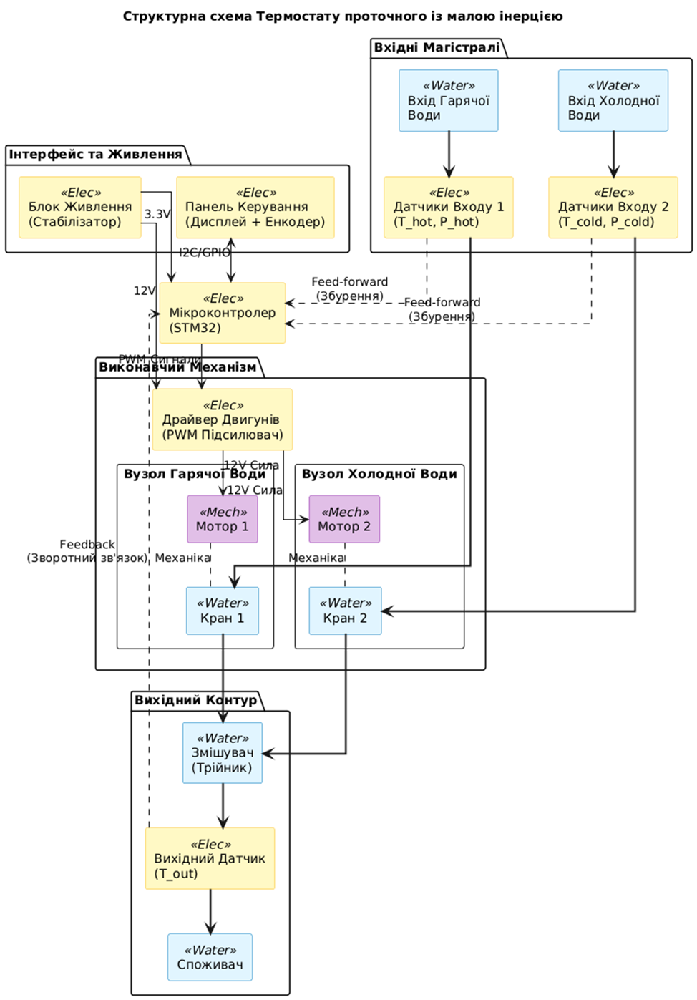
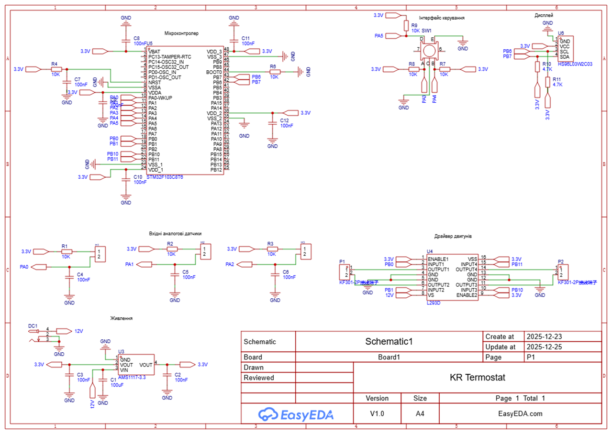
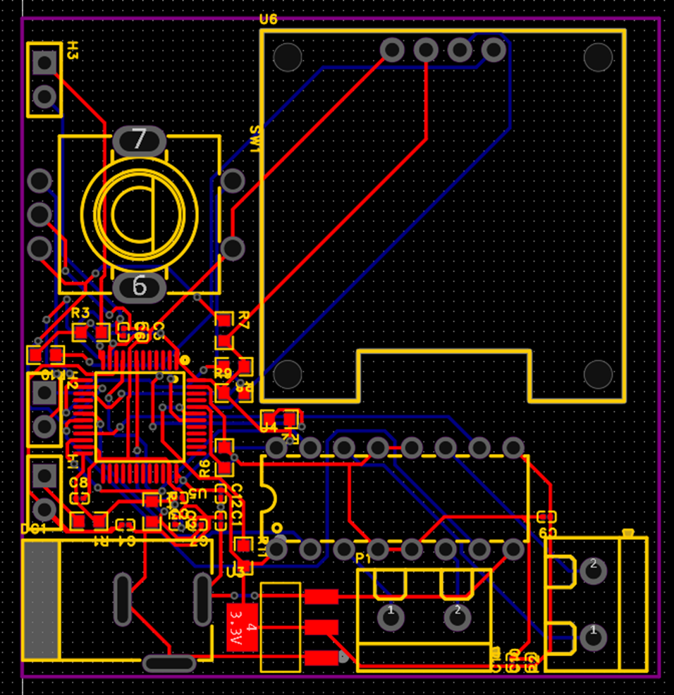

# Low-Inertia Flow Thermostat: Feed-Forward + PID Control System

A high-speed, closed-loop temperature control system designed to eliminate thermal inertia and suppress hydrodynamic disturbances in fluid mixing applications. This repository contains the C++ firmware (ESP32), control algorithm logic, and custom PCB hardware design.

---

## 🚀 System Architecture & Control Theory

Traditional mechanical thermostats suffer from massive thermal inertia (response times of several seconds), making them incapable of handling sudden pressure drops. This project solves that by implementing a dual-loop digital control strategy:

1. **Feed-Forward Control (Disturbance Rejection):** Pressure sensors on the input lines instantly detect pressure drops. The microcontroller preemptively calculates the required motor adjustment to maintain the fluid balance *before* the output temperature even begins to change.
2. **Feedback Control (PID):** A high-speed NTC thermistor ($R_{25} = 10k\Omega$) with a fast thermal response time ($\tau = 1.2s$) provides continuous feedback to a PID loop, eliminating steady-state errors with extreme precision.

### Block Diagram
*(Add your block diagram here by dragging and dropping `image_a3cc08.jpg` into the GitHub editor)*

---

## 💻 Firmware Implementation (C++)

The firmware is designed for a 32-bit ARM Cortex-M3 / Xtensa architecture, leveraging high-speed ADCs and hardware timers for motor control.

* **High-Frequency Sampling:** The control loop runs at 100 Hz ($dt = 0.01s$), enabling rapid response times.
* **Sensor Linearization:** Real-time calculation of the Steinhart-Hart equation to convert non-linear NTC voltage into accurate Celsius readings.
* **Actuator Control:** PWM generation via hardware timers directly drives the L293D motor bridge, ensuring smooth, non-disruptive positioning of the motorized ball valves to prevent overshoot.

---

## 🛠️ Hardware & PCB Design

To ensure signal integrity between the analog measurement circuits and the high-current motor drivers, a custom PCB was designed focusing on EMI reduction and proper grounding.

* **Microcontroller:** STM32 / ESP32-S3 core for rapid floating-point operations.
* **Motor Driver:** L293D H-Bridge with flyback diode protection for DC motor actuators.
* **Signal Conditioning:** Passive RC low-pass filters ($f_c \approx 160$ Hz) on the ADC inputs to filter out high-frequency noise without introducing phase delay to the control loop.

### Schematic & PCB Layout
*(Add your schematic here by dragging and dropping `image_a3cf0e.png` into the GitHub editor)*

*(Add your PCB layout here by dragging and dropping `image_a3cf09.jpg` into the GitHub editor)*

---

## ⚙️ How to Build
The firmware can be compiled and uploaded using PlatformIO or the Arduino IDE configured for ESP32.